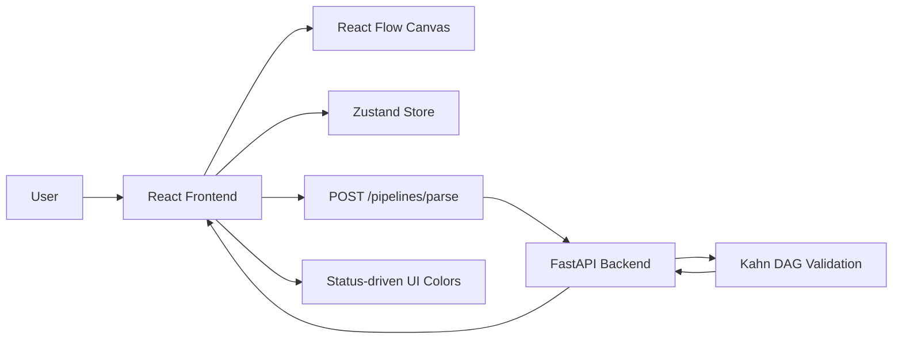
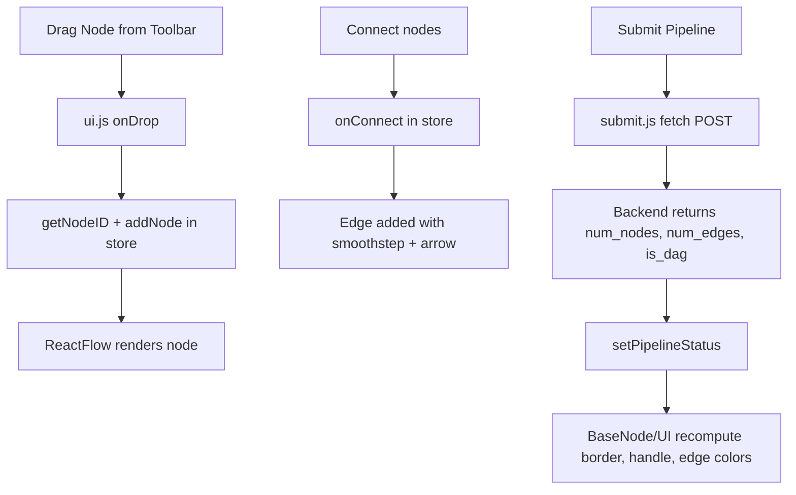
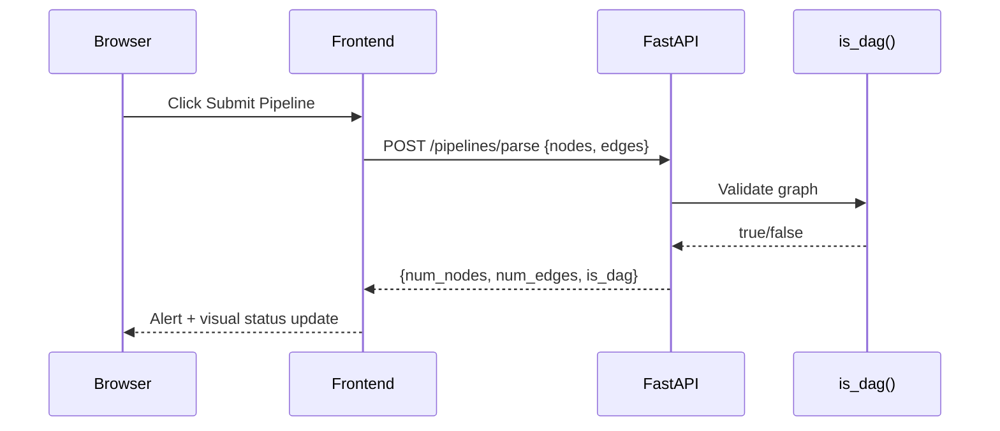
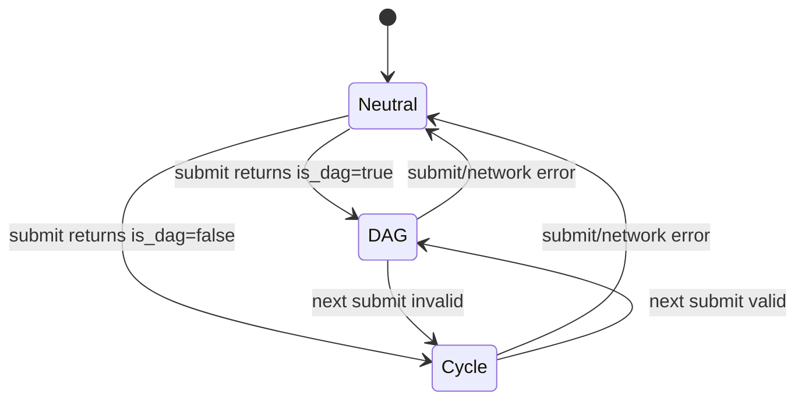

# VectorShift Frontend Technical Assessment

## Overview

This project implements a node-based pipeline builder with a React frontend and a FastAPI backend.
Users can drag nodes onto a canvas, connect them to form a directed graph, and submit the graph for server-side parsing and DAG validation.

The implementation covers all four requested parts:

1. Node abstraction + five additional node types
2. Styling improvements and modern UI system
3. Text node logic (dynamic handles + auto-resizing behavior)
4. Frontend/backend integration for pipeline parse and DAG check

---

## Tech Stack

### Frontend

- React (Create React App)
- React Flow (`reactflow@11`)
- Zustand for state management
- Tailwind CSS + PostCSS + Autoprefixer
- Lucide icons
- Poppins font (`@fontsource/poppins`)

### Backend

- FastAPI
- Uvicorn
- Python standard library graph utilities (`collections.deque`, `defaultdict`)

---

## Project Structure

```text
frontend_technical_assessment/
├─ backend/
│  └─ main.py
├─ frontend/
│  ├─ public/
│  │  └─ index.html
│  ├─ src/
│  │  ├─ App.js
│  │  ├─ ui.js
│  │  ├─ store.js
│  │  ├─ submit.js
│  │  ├─ toolbar.js
│  │  ├─ draggableNode.js
│  │  ├─ index.css
│  │  └─ nodes/
│  │     ├─ baseNode.js
│  │     ├─ inputNode.js
│  │     ├─ outputNode.js
│  │     ├─ llmNode.js
│  │     ├─ textNode.js
│  │     ├─ apiNode.js
│  │     ├─ mathNode.js
│  │     ├─ filterNode.js
│  │     ├─ delayNode.js
│  │     └─ jsonNode.js
│  └─ package.json
└─ README.md
```

---

## Setup and Run

## Backend

From the project root:

```bash
cd backend
python -m pip install fastapi uvicorn python-multipart
python -m uvicorn main:app --host 127.0.0.1 --port 8000 --reload
```

If port `8000` is already in use, stop the existing process or run with another port and update the frontend API URL accordingly.

## Frontend

From the project root:

```bash
cd frontend
npm install
npm start
```

Open `http://localhost:3000`.

---

## Assignment Implementation Details

## Part 1: Node Abstraction and New Node Types

### Strategy

Create one reusable `BaseNode` component that centralizes:

- Node shell and visual container
- Shared header (icon, title, subtitle, delete action)
- React Flow handle rendering
- Common padding and content area

Each concrete node becomes a small wrapper that only defines:

- Title/subtitle
- Handles configuration
- Node-specific content

### Implemented Nodes

- Existing: Input, Output, LLM, Text
- Added: API, Math, Filter, Delay, JSON

### Benefits

- Consistent behavior and style across all nodes
- Faster creation of new node types
- Lower duplication and easier maintenance

---

## Part 2: Styling and UI System

### Strategy

Use a design system approach:

- Tailwind utility classes for consistent spacing/typography
- Centralized React Flow overrides in `index.css`
- Single bold icon color for visual consistency
- Responsive layout for desktop and mobile

### Implemented UI Improvements

- Dark n8n-inspired theme using blue/black/gray/white palette
- Mesh-dotted canvas background
- Improved white text contrast and slightly larger typography
- Professional Lucide icon set across toolbar and nodes
- Responsive top bar, toolbar, and footer sections
- Footer social icon buttons (GitHub and LinkedIn)
- Navbar links for portfolio and profile pages

---

## Part 3: Text Node Dynamic Logic

### Strategy

Parse text content for `{{variable}}` tokens and map each unique variable to an input handle.

### Behavior

- Text content defaults to `{{input}}`
- Variable parser extracts identifiers with regex
- Each unique variable creates a left target handle
- Right output handle remains available
- Node width and height adapt to text length and line count

### Why This Works

The text node can now express dynamic dependencies directly from content, which is critical for pipeline authoring where placeholders represent upstream values.

---

## Part 4: Frontend-Backend Integration and DAG Validation

### Strategy

- Frontend posts graph payload (`nodes`, `edges`) to backend endpoint.
- Backend computes:
  - total node count
  - total edge count
  - DAG validity
- Frontend reflects response both in alert and in UI state.

### UI Feedback Model

`pipelineStatus` in Zustand drives visual feedback:

- `dag`: green node borders, green handles, green edges
- `cycle`: red node borders, red handles, red edges
- `null`: neutral defaults

This creates immediate visual validation feedback after each submit.

---

## Backend Design

`backend/main.py` provides:

- `GET /` health endpoint (`{"Ping":"Pong"}`)
- `OPTIONS /pipelines/parse` for browser preflight handling
- `POST /pipelines/parse` for graph parsing and DAG check
- CORS middleware allowing local frontend calls

### DAG Algorithm

The server uses Kahn's algorithm (topological sort):

1. Build indegree map for all valid nodes.
2. Add zero-indegree nodes to queue.
3. Repeatedly pop queue, decrement neighbors indegree.
4. Count visited nodes.
5. Graph is DAG when visited count equals total node count.

Time complexity: `O(V + E)`.

---

## System Architecture



---

## Frontend Data Flow



---

## Backend Request Flow



---

## State Model



---

## Key Engineering Decisions

- Component abstraction over copy/paste node UIs
- State-driven visuals rather than one-off DOM mutations
- Server-side DAG validation for correctness and determinism
- React Flow v11-compatible coordinate projection with `project()`
- Explicit preflight `OPTIONS` handler to avoid browser CORS issues

---

## API Contract

## Request

`POST /pipelines/parse`

```json
{
  "nodes": [{ "id": "text-1", "type": "text" }],
  "edges": [{ "source": "text-1", "target": "llm-1" }]
}
```

## Response

```json
{
  "num_nodes": 2,
  "num_edges": 1,
  "is_dag": true
}
```

---

## Validation Checklist

- Drag-and-drop node creation works
- All required nodes exist (including five new nodes)
- Text node creates dynamic handles from `{{variable}}`
- Pipeline submit calls backend endpoint correctly
- Backend returns node/edge counts and DAG status
- Node/handle/edge colors reflect DAG or cycle state
- UI remains usable on mobile and desktop

---

## Future Enhancements

- Persist pipeline JSON to local storage or backend
- Add inline graph validation messages (instead of alert only)
- Add test coverage for DAG edge cases and text parser cases
- Add environment-based API URL configuration

